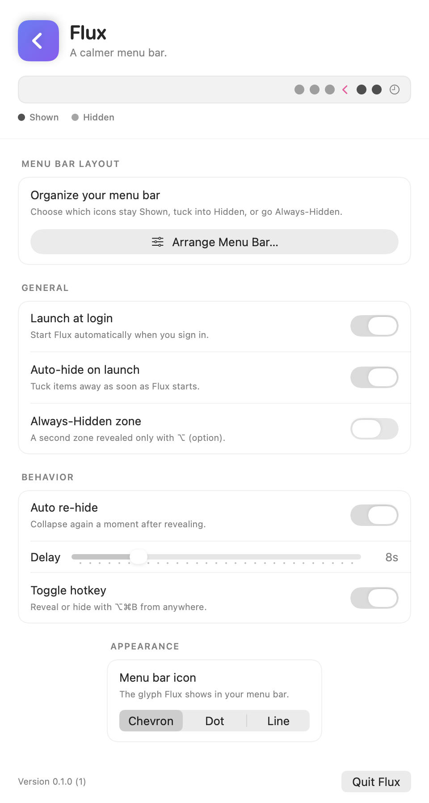
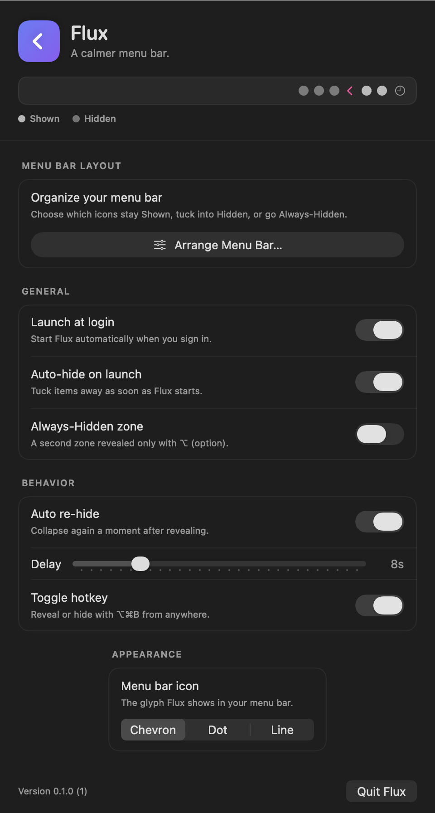

<div align="center">

# Flux

**A calmer menu bar.** A fast, stable, near-zero-resource menu bar manager for macOS — a Bartender alternative built for performance and stability first.

</div>

| Light | Dark |
| --- | --- |
|  |  |

---

## Why Flux

Most menu-bar managers feel buggy because they continuously **capture and redraw the
menu bar** with ScreenCaptureKit. That approach burns CPU/GPU, needs Screen Recording
permission, and breaks on every macOS update.

Flux takes the opposite approach. It plants its own invisible, expandable status
items as **section dividers** and collapses them to push other apps' icons off the
visible bar. The result:

- **~0% CPU at idle** — it only reacts to clicks, nothing polls or redraws.
- **No special permissions** — no Screen Recording, no Accessibility for the core MVP.
- **Stable across releases** — relies on documented `NSStatusItem` behaviour, not
  private or capture APIs. Targets **Sonoma (14), Sequoia (15), Tahoe (26)** and is
  forward-compatible with the upcoming **Golden Gate (27)**.

## The three zones (just like Bartender)

```
[ Always-Hidden ]  ‹‹  [ Hidden ]  ‹  [ Shown ]  🕓
                    │              │
            always-hidden       hidden divider
              divider           + Flux chevron
```

| Zone | Behaviour |
| --- | --- |
| **Shown** | Always visible. |
| **Hidden** | Revealed when you click the Flux chevron (the "drawer"). |
| **Always-Hidden** | Revealed only with **⌥ (option)** — kept fully out of the way. |

You assign an icon to a zone by **⌘-dragging** it to one side of a Flux divider — the
native macOS gesture. To make the (normally invisible) zone boundaries visible while
you do this, open **Arrange Menu Bar** — from Settings or the chevron's right-click
menu. Flux reveals every icon and drops a labeled marker at each boundary, so you can
see exactly where to drop each icon:

- Left of the **Hidden** marker → Hidden
- Left of the **Always Hidden** marker → Always-Hidden
- Right of the **Hidden** marker → Shown

Click **Done** (or the ✓ that replaces the chevron) to apply. Flux remembers the
arrangement across launches.

## Features (MVP)

- Auto-hide menu bar items on launch.
- Click the chevron (or press **⌥⌘B**) to reveal. Clicking a revealed icon **keeps it
  open** so you can use it; clicking down in a window re-hides.
- **Arrange Mode** — a guided editor that reveals labeled zone markers in the live
  menu bar so assigning icons to Shown / Hidden / Always-Hidden is clear and visible.
- Optional **Always-Hidden** zone.
- **Auto re-hide** after an adjustable delay.
- **Launch at login** (via `SMAppService` — the modern, sanctioned API).
- Three menu-bar icon styles: Chevron / Dot / Line.
- Light & dark, adapts to your system accent color.
- Runs as a true agent: no Dock icon, no app switcher entry.

## Install

Grab the latest **`Flux.dmg`** from the [Releases](../../releases) page, open it, and
drag **Flux** into **Applications**. On first launch, right-click the app → **Open**
(it's ad-hoc signed, not notarized). A **‹** chevron appears near your clock.

## Build & run

Requires Xcode 15+ (built and tested on Xcode 26 / Swift 6.3, macOS 26).

```bash
# Build the signed .app bundle → build/Flux.app
./Scripts/build_app.sh release

# Package a distributable disk image → build/Flux.dmg
./Scripts/build_dmg.sh

# Launch it
open build/Flux.app
```

Or for quick iteration:

```bash
swift build && swift run
```

### Developer / CI helpers

The executable understands a few headless flags used for testing:

```bash
Flux --selftest                     # functional test of the collapse engine
Flux --snapshot out.png [light|dark] # render the real settings UI to a PNG
```

## Architecture

```
Sources/Flux/
  main.swift                 # agent entry point (.accessory activation)
  App/AppDelegate.swift      # wires settings ↔ engine ↔ login ↔ hotkey
  MenuBar/
    MenuBarManager.swift     # reveal/collapse state machine, auto-rehide, menu, arrange
    ControlItem.swift        # one NSStatusItem as chevron or expandable divider
    MenuBarArranger.swift    # observable toggle for Arrange Mode (Settings ↔ engine)
    MenuBarSection.swift     # the three-zone model
    MenuBarIconStyle.swift   # chevron / dot / line
  Settings/
    SettingsStore.swift      # UserDefaults-backed, observable
    SettingsView.swift       # custom-card SwiftUI UI
    SettingsWindowController.swift
  Login/LoginItemManager.swift   # SMAppService launch-at-login
  Hotkey/HotkeyManager.swift     # Carbon global hotkey (⌥⌘B)
  Support/                       # logging, app info, render/snapshot/selftest
```

## Roadmap (post-MVP)

- **Per-app list control** and a searchable **drawer** popover (needs Accessibility +
  ScreenCaptureKit — deliberately deferred to keep the MVP resource-light).
- **Notch features** — use the notch area as the reveal drawer on notched Macs.
- Custom hotkey recording, profiles, triggers (show on update/active).

## License

[MIT](LICENSE) © 2026 Ammar Badawy.
